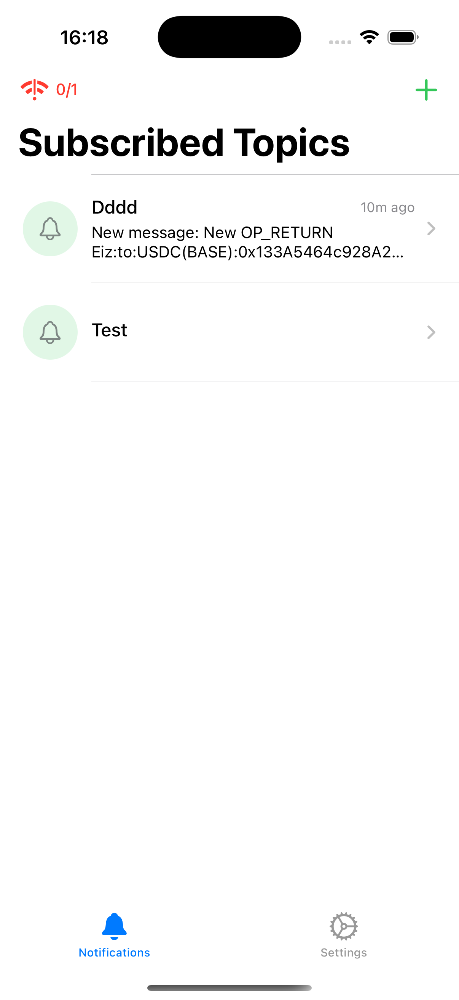
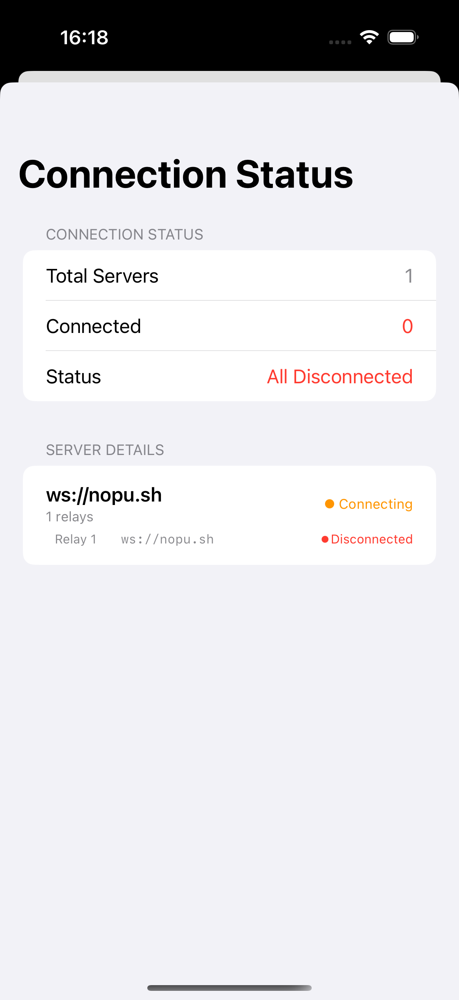
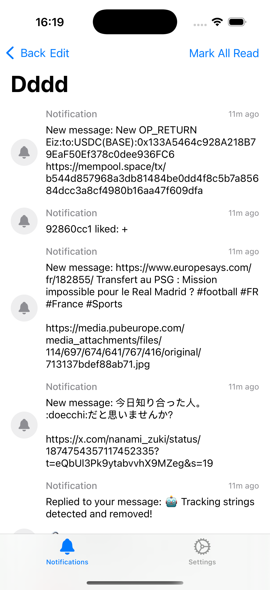
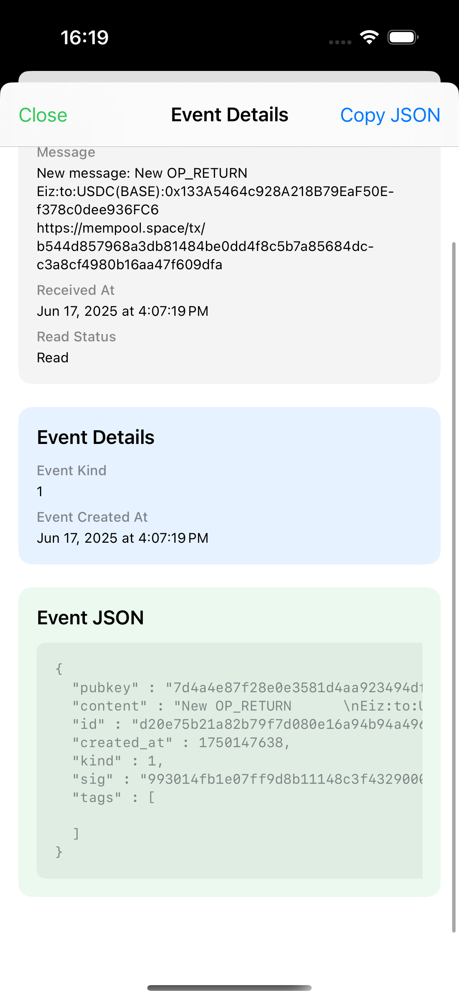
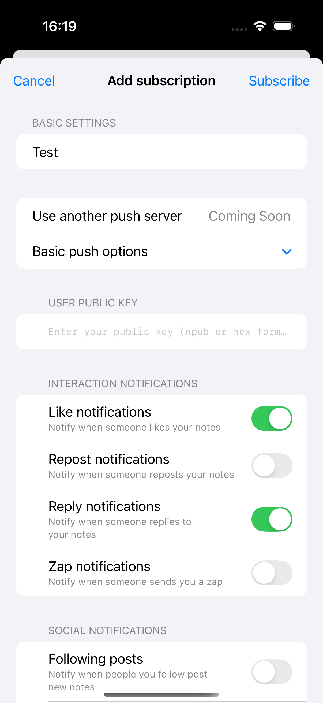
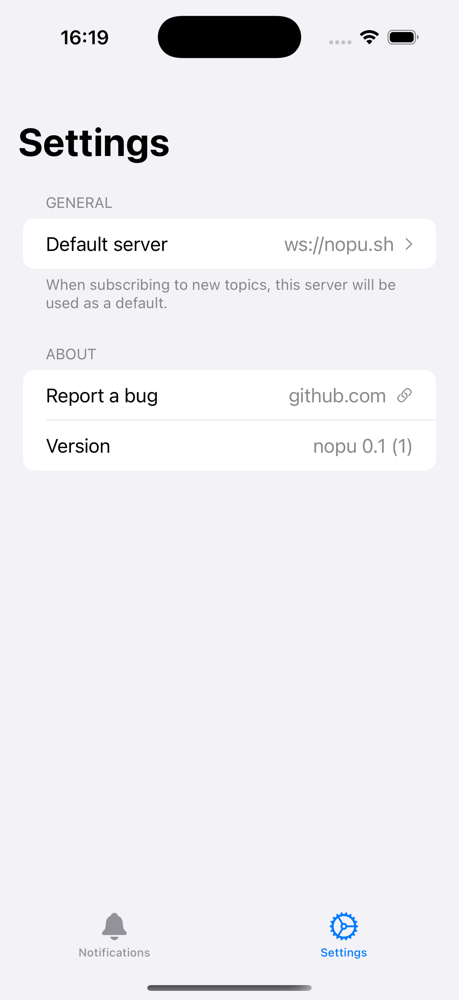

# nopu-ios

Nopu iOS client.

## App Screenshots

<table>
  <tr>
    <td></td>
    <td></td>
    <td></td>
  </tr>
  <tr>
    <td></td>
    <td></td>
    <td></td>
  </tr>
</table>

## Requirements
- Xcode 15 or later
- iOS 16.0 or later

## Getting Started
1. Clone the repository  
   ```bash
   git clone https://github.com/your_name/nopu-ios.git
   cd nopu-ios
   ```
2. Install dependencies  
   - Using Swift Package Manager:  
     Simply open `nopu-ios.xcodeproj` and Xcode will fetch dependencies automatically.
3. Run & Debug  
   Select a simulator or physical device, then click "Run" or press `⌘R`.

## Roadmap

### Completed
- Subscribe to any topic with fully customizable filters, just like the Nostr `REQ` filter grammar  
- iOS APNs push notifications  
- In-app notification & event persistence  

### Planned / In Progress
- More user-friendly notification previews  
- Advanced, fine-grained filter builder  
- More robust relay reconnection mechanism  
- Support for custom push servers  
- User account with the ability to restore topics  

## License
This project is released under the MIT License. See [LICENSE](LICENSE) for details.
